Stage 0: Hello server

 1. First setup the enviornment:
 Initialize node:
 `npm init`
 Install express:
 `npm install express`

2. Write the code (index.js)
    1. Initialize an app and set the port in the main file (index.js)
    2. Set the app to return "Hello World" message when it receives a get request to the root page (/)
    3. Set the app to listen on the specified port and print a message on the terminal "App listening on port" when the app is run.

3. Test
    1. Run `node index.js` on the terminal inside the project folder where the index.js file is
    2. Check if "App is listening on port:3000" prints on the terminal
    3. Visit localhost:3000 

    Test on terminal:
    `curl -i http://localhost:3000`
    use the following in windows to use curl
    `Remove-Item alias:curl`
    `curl -i http://localhost:3000`
    Check the output for HTTP response code (response = 200 OK)
    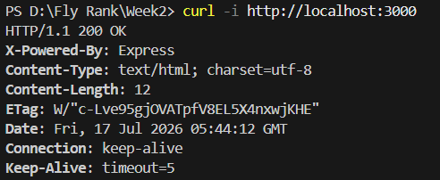

4. Push to github
    1. Create a new empty repository on github
    2. In you local projects folder run `git init` to initialize git locally
    3. Point remote git to the github repository `git remote add origin "your repository link"`
    4. Run `git add .` to add all changes to git
    5. Run `git commit -m "Your commit message"`
    6. Run `git push origin main` to push your local git to github.


Stage 1: Root and health endpoints

1. Write the code (index.js)
    1. Edit the previous root endpoint(/) to print a json response with name versions, and endpoints.
    2. Add a new endpoint (/health) that returns a json with the status message and timestamp

2. Test
    1. Run `node index.js` on the terminal inside the project folder where the index.js file is
    2. Check if "App is listening on port:3000" prints on the terminal
    3. Visit localhost:3000 
    4. Visit localhost:3000/health

    Test on terminal:

    `curl -i http://localhost:3000`
    Check the output for HTTP response code (response = 200 OK) and a message "{"name":"Task API","version":"1.0","endpoints":["/tasks"]}"

    `curl -i http://localhost:3000/health`
    Check the output for HTTP response code (response = 200 OK) and a message "{"status":"OK","timestamp":"2026-07-17T05:57:21.855Z"}"  
    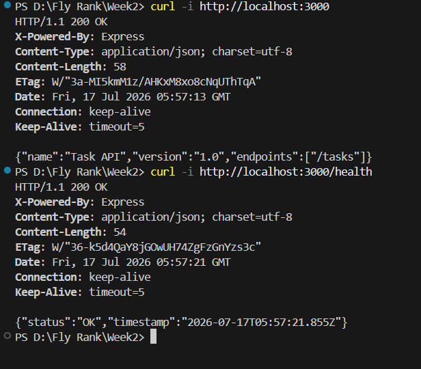

3. Push to github
    1. Run `git add .` to add all changes to git
    2. Run `git commit -m "Your commit message"`
    3. Run `git push origin main` to push your local git to github.


Stage 2: Create tasks endpoint with in memory array as database

1. Write the code
    1. Create an arrray (tasks) with three values each having an id, title, description, and completion status
    2. Create a new endpoint (/tasks) that sends a json response of the (tasks) array
    3. Create another endpoint (/tasks/:id) that sends a json response of the specific task id
        1. Convert the URL string into a parameter using parseInt(req.params.id)
        2. Handle error: create an if conditon where if the task id doesnt exist (!task), a json response is sent with a message "Task not found"
        3. Send a json response with the task if the id exists

2. Test
    1. Run `node index.js` on the terminal inside the project folder where the index.js file is
    2. Check if "App is listening on port:3000" prints on the terminal
    3. Visit localhost:3000/tasks 
    4. Visit localhost:3000/tasks/1
    5. Visit localhost:3000/tasks/100

    Test on terminal:

    `curl -i http://localhost:3000/tasks`
    Check the output for HTTP response code (response = 200 OK) and a message "[{"id":1,"title":"Task 1","description":"Create a hello world server","completed":true},{"id":2,"title":"Task 2","description":"Create root and health endpoints ","completed":true},{"id":3,"title":"Task 3","description":"Implement task CRUD operations","completed":false}]"

    `curl -i http://localhost:3000/tasks/1`
    Check the output for HTTP response code (response = 200 OK) and a message "{"id":1,"title":"Task 1","description":"Create a hello world server","completed":true}"  

    `curl -i http://localhost:3000/tasks/100`
    Check the output for HTTP response code (response = 404 Not Found) and a message "{"error":"Task not found"}"
    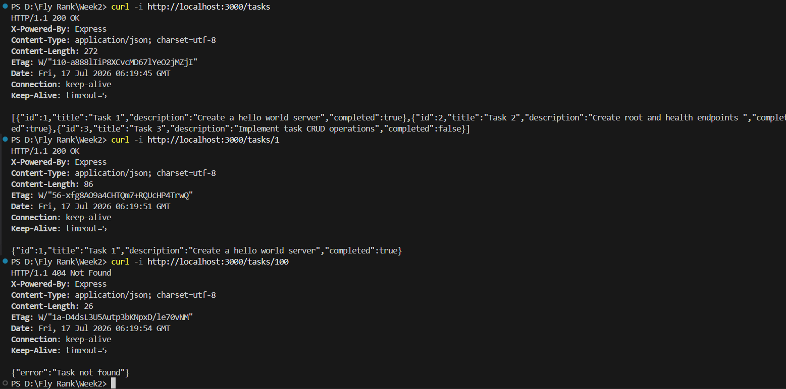

3. Push to github
    1. Run `git add .` to add all changes to git
    2. Run `git commit -m "Your commit message"`
    3. Run `git push origin main` to push your local git to github.


Stage 3: Create a new task


1. Write the code
    1. Add the express.json() middleware so that express can handle the payload inside POST requests.
    2. Create a new varible nextTaskID with a value of 4
    3. Create a new POST endpoinnt (/tasks) 
        1. Validation: Check if the title is missing (!title), not a string (!==string), and empty (title.trim() == '') 
        2. Handle error: create an if conditon where if the title doesnt fulfil the validation rules, a json response is sent with a message "Title is required and must be a non-empty string"
        3. Create a newTask object that assigns a new id (nextTaskId), title, description, and a completion status of "false" by default
        4. Add the new tasks to the tasks array with tasks.push(newTask)
        5. Return the newly created task in JSON format with a 201 status code

2. Test
    1. Run `node index.js` on the terminal inside the project folder where the index.js file is
    2. Check if "App is listening on port:3000" prints on the terminal

    curl -i -X POST http://localhost:3000/tasks -H "Content-Type: application/json" -d "{\`"title\`":\`"Task4\`"}" 
    Check the output for HTTP response code (response = 201 Created) and a message "{"id":4,"title":"Task4","description":"","completed":false}"

    `curl -i http://localhost:3000/tasks/4`
    Check the output for HTTP response code (response = 200 OK) and a message "{"id":4,"title":"Task4","description":"","completed":false}"  

    curl -i -X POST http://localhost:3000/tasks -H "Content-Type: application/json" -d "{\`"title\`":\`"\`"}"   
    Check the output for HTTP response code (response = 400 Bad Request) and a message "{"error":"Title is required and must be a non-empty string"}"

    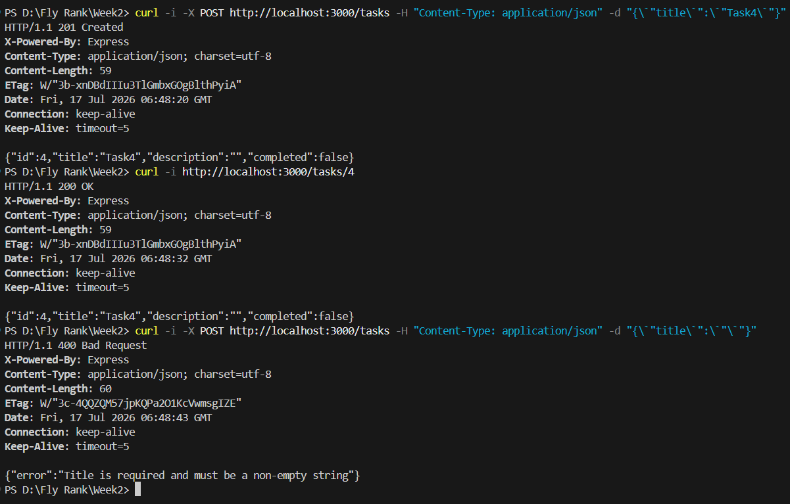

3. Push to github
    1. Run `git add .` to add all changes to git
    2. Run `git commit -m "Your commit message"`
    3. Run `git push origin main` to push your local git to github.


Stage 4: Update and delete tasks

1. Write the code
    1. Create a new PUT endpoint (/tasks/:id) to replace or modify an existing task's title and/or completion status
        1. Convert the URL string into an integer parameter using parseInt(req.params.id)
        2. Find the task index inside the array using tasks.findIndex()
        3. Handle error: create an if condition where if the task index doesn't exist (==-1), a json response is sent with a 404 status code and a message "Task not found"
        4. Validation: Check if the request body is empty or missing both updateable properties, and return a 400 status code with a message "Empty or invalid body"
        5. Validation: If a title is provided, ensure it is a non-empty string, otherwise return a 400 status code with an error message
        6. Validation: Normalize incoming done status (accepts either done or completed) and ensure it is a boolean, otherwise return a 400 status code with an error message
        7. Apply the changes directly to the target item inside your array and return the updated task object with a 200 OK status code
    2. Create a new DELETE endpoint (/tasks/:id) to remove a task completely from the array
        1. Convert the URL string into an integer parameter using parseInt(req.params.id)
        2. Find the task index inside the array using tasks.findIndex()
        3. Handle error: create an if condition where if the task index doesn't exist (==-1), a json response is sent with a 404 status code and a message "Task not found"
        4. Remove the task item from the array using the tasks.splice() method
        5. Send back a 204 status code ("No Content") with a completely empty body using res.status(204).send()

2. Test
    1. Run `node index.js` on the terminal inside the project folder where the index.js file is
    2. Check if "App is listening on port:3000" prints on the terminal

    curl -i -X PUT http://localhost:3000/tasks/1 -H "Content-Type: application/json" -d "{\`"title\`":\`"UpdatedTask1\`",\`"done\`":false}"
    Check the output for HTTP response code (response = 200 OK) and a message "{"id":1,"title":"UpdatedTask1","description":"Create a hello world server","completed":false}"

    curl -i -X PUT http://localhost:3000/tasks/1 -H "Content-Type: application/json" -d "{}"
    Check the output for HTTP response code (response = 400 Bad Request) and a message "{"error":"Empty or invalid body"}"

    curl -i -X PUT http://localhost:3000/tasks/999 -H "Content-Type: application/json" -d "{\`"title\`":\`"Ghost\`",\`"done\`":true}"
    Check the output for HTTP response code (response = 404 Not Found) and a message "{"error":"Task not found"}"

    `curl -i -X DELETE http://localhost:3000/tasks/1`
    Check the output for HTTP response code (response = 204 No Content) and confirm that the response payload body is completely empty

    `curl -i http://localhost:3000/tasks`
    Check the output for HTTP response code (response = 200 OK) and confirm that Task 1 has been completely removed from the printed list
    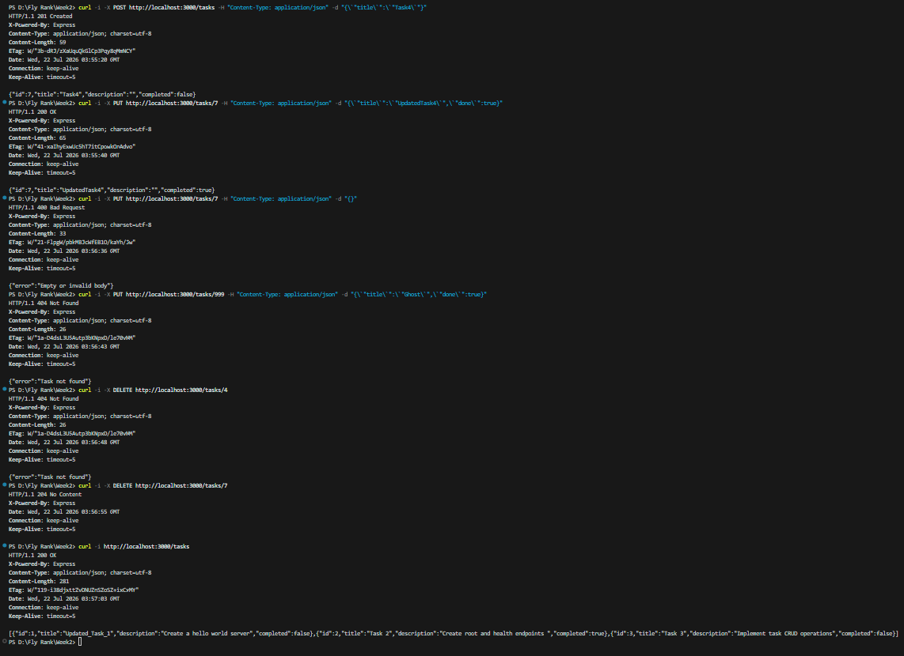

3. Push to github
    1. Run `git add .` to add all changes to git
    2. Run `git commit -m "Stage 4: full CRUD"`
    3. Run `git push origin main` to push your local git to github.


Stage 5: Swagger UI

1. Write the code
    1. Install swagger-ui-express by running `npm install swagger-ui-express` in your terminal
    2. Create a new file named `openapi.json` in your root project folder to describe all CRUD endpoints
    3. Update `index.js` to require `swagger-ui-express` and `openapi.json`
    4. Mount the Swagger UI route at `/docs` using `app.use('/docs', swaggerUi.serve, swaggerUi.setup(swaggerDocument))`

2. Test
    1. Run `node index.js` on the terminal inside the project folder where the index.js file is
    2. Check if "App listening on port 3000" and "Swagger UI documentation available at http://localhost:3000/docs" prints on the terminal
    3. Visit `localhost:3000/docs` in your browser to view the interactive documentation
    4. Test all CRUD endpoints using the "Try it out" button on the web page

    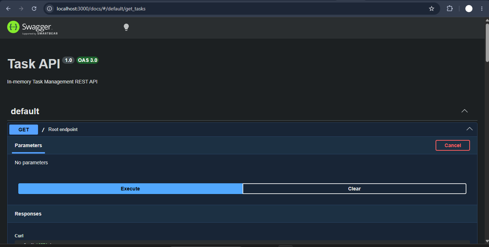

3. Push to github
    1. Run `git add .` to add all changes to git
    2. Run `git commit -m "Stage 5: Swagger UI"`
    3. Run `git push origin main` to push your local git to github.


Stage 6: Publish and docs

1. Write the code
    1. Create a `.gitignore` file in your root folder and add `node_modules/` so unnecessary files are ignored by git
    2. Review and format your complete `README.md` file to ensure all setup instructions, endpoint details, and terminal checks from Stage 0 to Stage 6 are cleanly documented

2. Test
    1. Run `git status` on the terminal inside the project folder to make sure your working directory is clean
    2. Run `git log --oneline` on the terminal to verify all stage commits are present and ordered properly
    3. Visit your repository page on GitHub in your browser to verify that all code, images, and README details are rendered correctly

    Test on terminal:

    `git status`
    Check the output for a message "nothing to commit, working tree clean"

    `git log --oneline`
    Check the output to confirm you have at least 7 clean stage commits:
    - Stage 6: publish and docs
    - Stage 5: Swagger UI
    - Stage 4: full CRUD
    - Stage 3: create with validation
    - Stage 2: read endpoints with 404
    - Stage 1: root and health endpoints
    - Stage 0: hello server

    `git remote -v`
    Check the output to verify your remote origin points to your public GitHub repository link

3. Push to github
    1. Run `git add .` to add all final documentation changes to git
    2. Run `git commit -m "Stage 6: publish and docs"`
    3. Run `git push origin main` to push your final code to github.


SQLite Database

Stage 0: Create SQLite database

1. Write the code
    1. Install `better-sqlite3` by running `npm install better-sqlite3` in your terminal
    2. Import `better-sqlite3` in `index.js` and connect to a local database file named `tasks.db`
    3. Execute a SQL query `CREATE TABLE IF NOT EXISTS tasks` with columns `id` (INTEGER PRIMARY KEY AUTOINCREMENT), `title` (TEXT), and `done` (BOOLEAN)
    4. Execute a SQL check `SELECT COUNT(*)` to ensure example tasks are inserted only if the database table is completely empty

2. Test
    1. Run `node index.js` on the terminal inside the project folder
    2. Check if "SQLite database connected (tasks.db)" prints on the terminal
    3. Verify that a file named `tasks.db` is automatically created in your root project folder
    4. Restart your server multiple times using `node index.js` and confirm the seed tasks are not duplicated

3. Push to github
    1. Run `git add .` to add all changes to git
    2. Run `git commit -m "Stage 0: create SQLite database"`
    3. Run `git push origin main` to push your local git to github.


Stage 1: Database read endpoints

1. Write the code
    1. Update `GET /tasks` endpoint to retrieve all records from SQLite using `SELECT id, title, done FROM tasks`
    2. Update `GET /tasks/:id` endpoint to retrieve a single record using `SELECT id, title, done FROM tasks WHERE id = ?`
    3. Handle error: Return a 404 status code with error JSON `{"error":"Task not found"}` if no row matches the given ID

2. Test
    1. Run `node index.js` on the terminal inside the project folder
    2. Check if "App listening on port 3000" prints on the terminal

    Test on terminal:

    `curl -i http://localhost:3000/tasks`
    Check the output for HTTP response code (response = 200 OK) and a message containing tasks from `tasks.db`

    `curl -i http://localhost:3000/tasks/1`
    Check the output for HTTP response code (response = 200 OK) and the single task object

    `curl -i http://localhost:3000/tasks/999`
    Check the output for HTTP response code (response = 404 Not Found) and message `{"error":"Task not found"}`

3. Push to github
    1. Run `git add .` to add all changes to git
    2. Run `git commit -m "Stage 1: database read endpoints"`
    3. Run `git push origin main` to push your local git to github.
   


Stage 2: Insert into database

1. Write the code
    1. Update `POST /tasks` endpoint to insert a new row using `INSERT INTO tasks (title, done) VALUES (?, ?)`
    2. Maintain validation checks: return 400 Bad Request if `title` is missing or empty
    3. Retrieve the generated auto-increment ID using `result.lastInsertRowid` and return the newly created task with a 201 Created status code

2. Test
    1. Run `node index.js` on the terminal inside the project folder

    Test on terminal:

    `curl -i -X POST http://localhost:3000/tasks -H "Content-Type: application/json" -d "{\`"title\`":\`"Buy milk\`"}"`
    Check the output for HTTP response code (response = 201 Created) and the newly created task with auto-generated database ID

    Restart your server (`Ctrl + C` then `node index.js`) and run:
    `curl -i http://localhost:3000/tasks`
    Verify that "Buy milk" still exists in the database list after server restart

3. Push to github
    1. Run `git add .` to add all changes to git
    2. Run `git commit -m "Stage 2: insert into database"`
    3. Run `git push origin main` to push your local git to github.


Stage 3: Update and delete with SQL

1. Write the code
    1. Update `PUT /tasks/:id` endpoint to modify existing task rows using `UPDATE tasks SET title = ?, done = ? WHERE id = ?`
    2. Return 404 status code if the row ID does not exist, and 400 status code if input payload is empty or invalid
    3. Update `DELETE /tasks/:id` endpoint to remove a task row using `DELETE FROM tasks WHERE id = ?`
    4. Return 204 No Content with empty response body upon successful deletion

2. Test
    1. Run `node index.js` on the terminal inside the project folder

    Test on terminal:

    `curl -i -X PUT http://localhost:3000/tasks/1 -H "Content-Type: application/json" -d "{\`"title\`":\`"Updated Task 1\`",\`"completed\`":true}"`
    Check for 200 OK status code and updated database values

    `curl -i -X DELETE http://localhost:3000/tasks/1`
    Check for 204 No Content status code and empty body

    `curl -i http://localhost:3000/tasks/1`
    Check for 404 Not Found status code confirming permanent deletion from SQLite database

3. Push to github
    1. Run `git add .` to add all changes to git
    2. Run `git commit -m "Stage 3: update and delete with SQL"`
    3. Run `git push origin main` to push your local git to github.


Stage 4: Explored SQLite

1. Write the code
    1. Open `tasks.db` using DB Browser for SQLite (or VS Code SQLite extension)
    2. Execute standard manual SQL queries directly against the database file:
       - `SELECT * FROM tasks;`
       - `SELECT * FROM tasks WHERE done = 1;`
       - `SELECT COUNT(*) FROM tasks;`
       - `UPDATE tasks SET done = 1;`
       - `DELETE FROM tasks WHERE done = 1;`
       
2. Test
    1. Perform a manual update query in DB Browser for SQLite (e.g., `UPDATE tasks SET done = 1;`)
    2. Run `curl -i http://localhost:3000/tasks` in your terminal
    3. Verify that the API immediately reflects the direct database changes

3. Push to github
    1. Run `git add .` to add all changes to git
    2. Run `git commit -m "Stage 4: explored SQLite"`
    3. Run `git push origin main` to push your local git to github.


Stage 5: Database documentation

1. Write the code
    1. Update `.gitignore` file to ensure database binary logs and `node_modules/` are managed cleanly
    2. Add detailed database selection reasoning, path information, and execution steps to `README.md`
    3. Save a screenshot of the database viewer running queries on `tasks.db` into `uploads/db-browser-screenshot.png`

    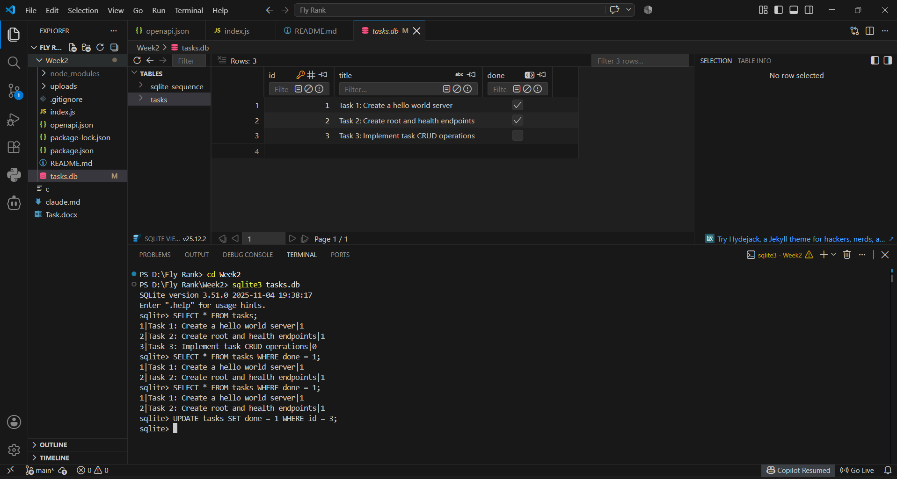

2. Project Architecture & SQL Details
    - **Why SQLite was chosen:** SQLite is zero-configuration, serverless, and stores all relational data inside a single lightweight file (`tasks.db`). This makes it ideal for embedded backend applications and persistent local development without running a separate database daemon.
    - **Database file location:** Root directory `./tasks.db`
    - **How to start the project:**
      ```bash
      npm install
      node index.js
      ```
    - **Sample SQL Query Executed:**
      ```sql
      sqlite3 tasks.db
      SELECT id, title, done FROM tasks WHERE done = 1;
      ```

3. Push to github
    1. Run `git add .` to add all documentation changes to git
    2. Run `git commit -m "Stage 5: database documentation"`
    3. Run `git push origin main` to push your final code to github.


# Task API - Postgres + Docker (A3)

This is a direct continuation of the Week 2 SQLite version (A2) - the storage engine changed from `better-sqlite3` to Postgres running in Docker. Everything else - routes, validation, response shapes (`completed` in JSON, mapped to a `done` column), error messages, Swagger docs - is unchanged.

## What this is

Same 5 CRUD endpoints, same seed data, same `/health` shape as the SQLite version. The only new file that talks to the database is `repository.js`. `index.js` calls its methods (`getAll`, `getById`, `create`, `update`, `remove`) exactly the way it previously called `db.prepare(...)` - proving the storage swap really did only touch one file.

## How to run it

```bash
cp .env.example .env
docker compose up
```
Run all other commands on another terminal. 

API starts at `http://localhost:3000`. Swagger docs at `http://localhost:3000/docs`, same as before.

## Endpoints

| Method | Path        | Description                  | Success | Errors   |
|--------|-------------|------------------------------|---------|----------|
| GET    | /           | API info                     | 200     | -        |
| GET    | /health     | Health check                 | 200     | -        |
| GET    | /tasks      | List all tasks               | 200     | -        |
| GET    | /tasks/:id  | Get a single task            | 200     | 404      |
| POST   | /tasks      | Create a new task            | 201     | 400      |
| PUT    | /tasks/:id  | Update a task's title/done   | 200     | 400, 404 |
| DELETE | /tasks/:id  | Delete a task                | 204     | 404      |


## Architecture note

The SQLite version wrote raw `db.prepare(...)` calls directly inside each route handler. Moving to Postgres meant extracting that into `repository.js`, which exposes the same operations (`getAll`, `getById`, `create`, `update`, `remove`) but backed by `pg` and parameterized `$1`-style queries instead of `better-sqlite3`'s `?` placeholders. Every route handler in `index.js` calls the repository the same way regardless of what's behind it - the only route-level change was adding `async`/`await`, since Postgres queries are asynchronous and SQLite's were not.

## Persistence - how it was checked

Created a task, updated another's completion status, deleted a third - then restarted the Postgres server entirely (not just the app) and queried the database directly with `psql`, no app involved. All changes were intact. This is the volume (`taskdata` in `compose.yaml`) doing its job: Postgres's data files live outside the container, so removing/recreating the container doesn't erase them.

## Database Screenshot
Query run directly against the Postgres container:

``` docker exec -it week2-db-1 psql -U postgres -d tasks -c "SELECT * FROM tasks;" ```

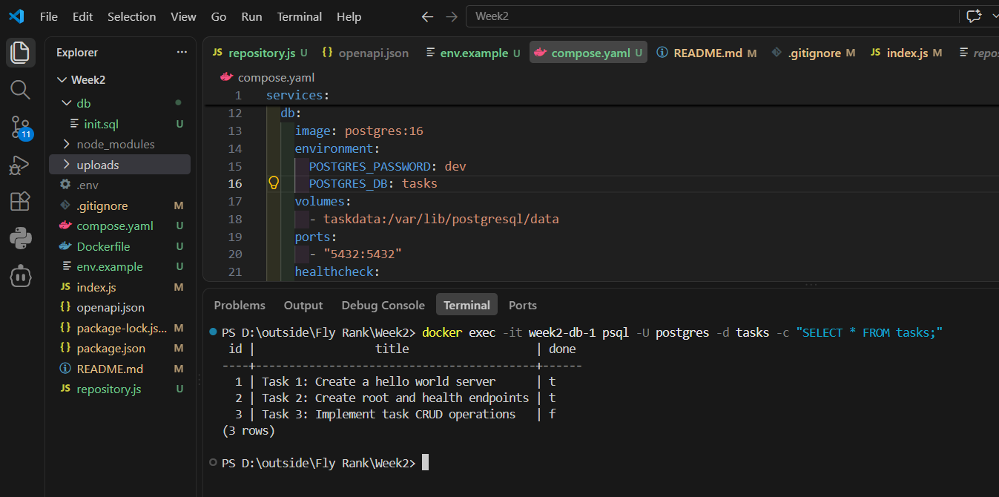


Create a new task via the API
``` Invoke-RestMethod -Uri http://localhost:3000/tasks -Method Post -ContentType "application/json" -Body (@{title="persistence test"} | ConvertTo-Json) ```

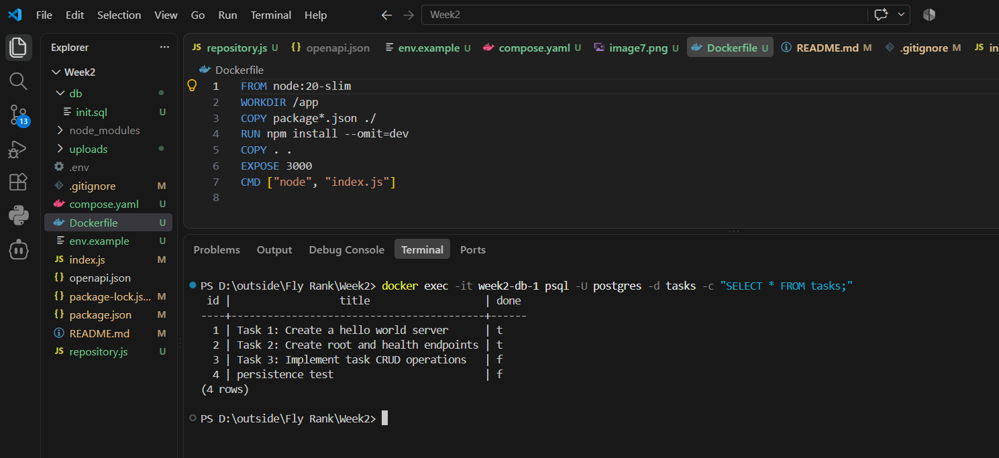

Stop everything
In your docker compose up terminal: Ctrl+C, then run: ``` docker compose down ```
Start it back up
``` docker compose up ``` again - wait for 'Postgres database connected'.

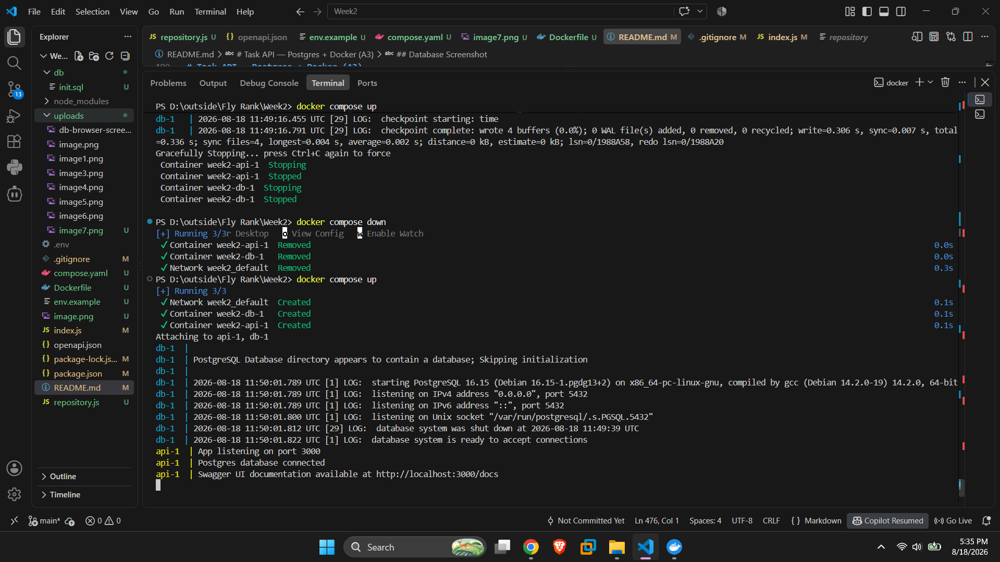

Query again
``` docker exec -it week2-db-1 psql -U postgres -d tasks -c "SELECT * FROM tasks;" ```

The 'persistence test' row should still be there.

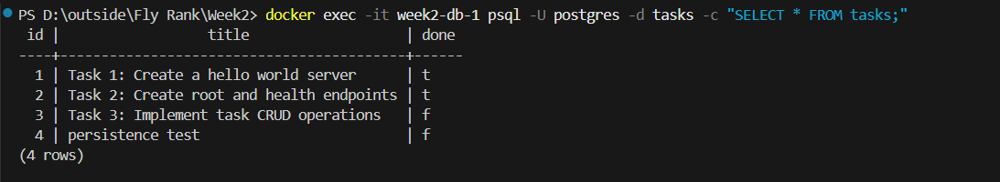


